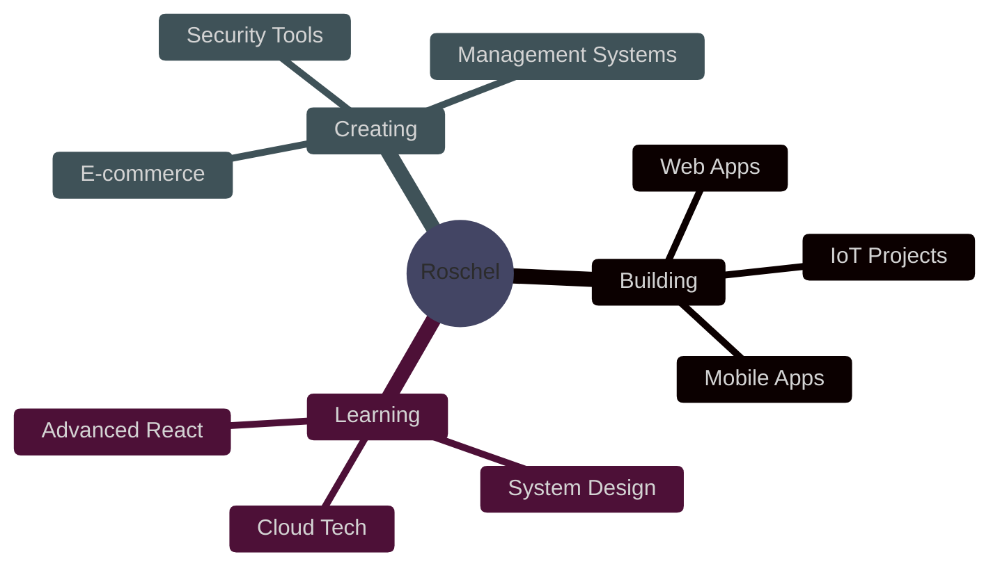

<div align="center">
  
  

</div>

<p align="center">
  
</p>

<p align="center">
  <a href="https://www.facebook.com/roschelmae.anoos.1">
    
  </a>
  <a href="https://www.instagram.com/ru_shelll?igsh=MW5jNGZnYmswZHRwNA==">
    
  </a>
  <a href="https://twitter.com/Roschelmae2">
    
  </a>
  
</p>

<br>


<br>

## 💫 Quick Facts

```javascript
const roschel = {
    pronouns: "she/her",
    location: "Philippines 🇵🇭",
    currentFocus: ["Full-Stack Development", "Mobile Apps", "IoT Projects"],
    funFact: "I debug with console.log() and I'm not ashamed! 😄",
    lifePhilosophy: "Code, Coffee, Create, Repeat ☕💻✨",
    
    techStack: {
        frontend: ["React", "React Native", "Next.js", "TailwindCSS"],
        backend: ["Node.js", "Laravel", "PHP"],
        databases: ["MongoDB", "MySQL", "PostgreSQL"],
        languages: ["JavaScript", "TypeScript", "Python", "PHP", "C++"],
        tools: ["Git", "Vite", "Raspberry Pi"]
    },
    
    currentlyLearning: ["IoT Development", "Advanced React Patterns", "System Design"],
    askMeAbout: ["Web Dev", "Mobile Apps", "MongoDB", "React", "Laravel"],
    
    workingOn: {
        project: "Building cool stuff that matters 🚀",
        goal: "Creating impactful solutions for real-world problems"
    }
};
```

<br>


<br>

## 🛠️ Tech Arsenal

<div align="center">

### 🎨 Frontend Magic


### ⚙️ Backend Power


### 🗄️ Database Wizardry


### 💻 Languages I Speak


### 🔧 Tools & Platforms


</div>

<br>


<br>

## 📊 GitHub Analytics

<div align="center">
  
  
</div>

<div align="center">
  
  
</div>

<br>

<div align="center">
  
</div>

<br>


<br>

## 🎯 Featured Projects

<div align="center">

<table>
<tr>
<td width="50%">

### 🌊 ProtectOcean
  

Full-stack web & mobile app for reporting illegal ocean activities and protecting marine life.

**Features:**
- 📍 Real-time geolocation tracking
- 🗑️ Trash monitoring system
- 🚨 Illegal activity reporting
- 🌊 Marine life protection

</td>
<td width="50%">

### 🏛️ SmartB Barangay System
 

Digital barangay management system for online document requests and blotter reports.

**Features:**
- 📄 Online document requests
- 📝 Blotter filing system
- 📊 Request tracking
- 👥 Citizen portal

</td>
</tr>

<tr>
<td width="50%">

### ⚡ SingKarga Charging Station
  

IoT charging station management with Raspberry Pi integration.

**Features:**
- 🔌 Real-time monitoring
- 💳 Payment management
- 📈 Usage tracking
- 🤖 Hardware integration

</td>
<td width="50%">

### 🛡️ Email Phishing Detector
 

Security tool that analyzes and detects phishing attempts in emails.

**Features:**
- 🔍 Pattern detection
- ⚠️ Threat analysis
- 🚨 User alerts
- 🛡️ Scam prevention

</td>
</tr>

<tr>
<td width="50%">

### 🛒 E-Commerce Projects
  

Multiple online stores: Ice Cream Shop & Dress Shop.

**Features:**
- 🛍️ Shopping cart system
- 💳 Payment integration
- 📦 Inventory management
- 📊 Order tracking

</td>
<td width="50%">

### 💼 More Projects
  

School Website, PC Inventory System, Phone Shop POS, File Handling System.

**Technologies:**
- 🖥️ Desktop applications
- 🌐 Web development
- 📊 Database management
- 🎨 UI/UX design

</td>
</tr>
</table>

</div>

<br>


<br>

## 🎨 What I'm Up To

<div align="center">



</div>

<table align="center">
  <tr>
    <td align="center" width="33%">
      
      <br><strong>Building</strong>
      <br>Responsive web apps with React
    </td>
    <td align="center" width="33%">
      
      <br><strong>Developing</strong>
      <br>Cross-platform mobile apps
    </td>
    <td align="center" width="33%">
      
      <br><strong>Creating</strong>
      <br>Full-stack solutions
    </td>
  </tr>
  <tr>
    <td align="center" width="33%">
      
      <br><strong>Exploring</strong>
      <br>IoT & hardware projects
    </td>
    <td align="center" width="33%">
      
      <br><strong>Designing</strong>
      <br>Beautiful UI/UX
    </td>
    <td align="center" width="33%">
      
      <br><strong>Learning</strong>
      <br>New technologies daily
    </td>
  </tr>
</table>

<br>


<br>

## 💬 Let's Connect & Collaborate!

<div align="center">

 

**I'm always excited to collaborate on interesting projects or discuss new technologies!**

<br>

<a href="https://www.facebook.com/roschelmae.anoos.1">
  
</a>
<a href="https://www.instagram.com/ru_shelll?igsh=MW5jNGZnYmswZHRwNA==">
  
</a>
<a href="https://twitter.com/Roschelmae2">
  
</a>

<br><br>

### 💡 Open to:
✨ Collaborating on open source projects  
🚀 Freelance opportunities  
💼 Full-time positions  
🤝 Networking with fellow developers  
📚 Sharing knowledge and learning together

</div>

<br>


<br>

<div align="center">
  
### 🐍 Watch my contribution graph get eaten by the snake!

<picture>
  <source media="(prefers-color-scheme: dark)" srcset="https://raw.githubusercontent.com/Rossyyyyyy/Rossyyyyyy/output/github-contribution-grid-snake-dark.svg">
  <source media="(prefers-color-scheme: light)" srcset="https://raw.githubusercontent.com/Rossyyyyyy/Rossyyyyyy/output/github-contribution-grid-snake.svg">
  
</picture>

<br><br>


<br><br>

### ☕ Support My Work

If you like what I do, consider buying me a coffee! ☕

<a href="https://www.buymeacoffee.com/rossyyyyyy">
  
</a>

<br><br>


**Thanks for visiting! Let's build something amazing together! 🚀✨**

<sub>⭐️ From [Rossyyyyyy](https://github.com/Rossyyyyyy) with 💜</sub>

</div>
