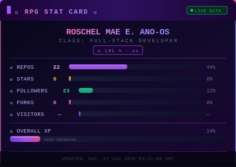

<!-- AUTO-GENERATED custom header — rebuilt every 12h via GitHub Actions -->


<div align="center">


</div>

<br>

<div align="center">

</div>

<div align="center">

```
╔══════════════════════════════════════════════════════════╗
║                  ⚔  PLAYER PROFILE  ⚔                   ║
╠══════════════════════════════════════════════════════════╣
║  NAME    : Roschel Mae                                   ║
║  CLASS   : Full-Stack Developer                          ║
║  GUILD   : IT Student  🎓                                ║
║  REGION  : Philippines  🇵🇭                              ║
║  PRONOUNS: she/her  🌸                                   ║
╠══════════════════════════════════════════════════════════╣
║  MAIN QUEST  : Building impactful web & mobile apps      ║
║  SIDE QUEST  : IoT & hardware exploration                ║
║  SECRET SKILL: Debugs with console.log() unashamedly 😂  ║
║  MOTTO       : Code → Coffee → Create → Repeat ☕        ║
╚══════════════════════════════════════════════════════════╝
```

</div>

<br>

<!-- Social badges styled as game buttons -->
<div align="center">

[](https://www.facebook.com/roschelmae.anoos.1)
[](https://www.instagram.com/ru_shelll?igsh=MW5jNGZnYmswZHRwNA==)
[](https://twitter.com/Roschelmae2)

</div>

<!-- ═══════════════════════════════════════ -->
<!--           VISITOR COUNTER              -->
<!-- ═══════════════════════════════════════ -->

<div align="center">

```
╔══════════════════════════════════════════╗
║           👁  VISITORS LOG  👁           ║
╚══════════════════════════════════════════╝
```


&nbsp;&nbsp;


<sub><i>Every visit counts — thanks for stopping by, adventurer! 🎮</i></sub>

</div>

<br>

<div align="center">

</div>

<br>

<!-- ═══════════════════════════════════════ -->
<!--           STATS / LIVE DATA            -->
<!-- ═══════════════════════════════════════ -->

##  PLAYER STATS  <sub><sup>[ LIVE DATA FROM GITHUB ]</sup></sub>

<div align="center">

<!-- AUTO-GENERATED custom RPG stats card — rebuilt every 12h -->



</div>

<div align="center">


</div>

<div align="center">


</div>

<br>

<!-- Trophy shelf styled as achievements -->
<div align="center">

**🏆 ACHIEVEMENTS UNLOCKED**


</div>

<br>

<div align="center">

</div>

<br>

<!-- ═══════════════════════════════════════ -->
<!--           SKILL TREE                   -->
<!-- ═══════════════════════════════════════ -->

##  SKILL TREE

<div align="center">

<table border="0">
<tr>
<td align="center" valign="top" width="25%">

** FRONTEND**
`[ MASTERED ]`


</td>
<td align="center" valign="top" width="25%">

** BACKEND**
`[ MASTERED ]`


</td>
<td align="center" valign="top" width="25%">

** DATABASES**
`[ MASTERED ]`


** TOOLS**
`[ EQUIPPED ]`


</td>
<td align="center" valign="top" width="25%">

** LANGUAGES**
`[ UNLOCKED ]`


</td>
</tr>
</table>

</div>

<br>

<div align="center">

</div>

<br>

<div align="center">

</div>

<br>

<!-- ═══════════════════════════════════════ -->
<!--           QUEST LOG / PROJECTS         -->
<!-- ═══════════════════════════════════════ -->

##  QUEST LOG  <sub><sup>[ COMPLETED MISSIONS ]</sup></sub>

<div align="center">

<table border="0" cellpadding="10">
<tr>
<td width="50%" valign="top">
<div align="center">

**`[ QUEST COMPLETE ✔ ]`**
###  ProtectOcean


> Full-stack web & mobile app for reporting illegal ocean activities and protecting marine life.

| Feature | Status |
|---|:---:|
| 📍 Real-time geolocation | ✅ |
| 🗑️ Trash monitoring | ✅ |
| 🚨 Illegal activity reporting | ✅ |
| 🐟 Marine life protection | ✅ |

</div>
</td>
<td width="50%" valign="top">
<div align="center">

**`[ QUEST COMPLETE ✔ ]`**
###  SmartB Barangay System


> Digital barangay management system for online document requests and blotter reports.

| Feature | Status |
|---|:---:|
| 📄 Online document requests | ✅ |
| 📝 Blotter filing system | ✅ |
| 📦 Request tracking | ✅ |
| 👥 Citizen portal | ✅ |

</div>
</td>
</tr>

<tr>
<td width="50%" valign="top">
<div align="center">

**`[ QUEST COMPLETE ✔ ]`**
###  SingKarga Charging Station


> IoT charging station management with Raspberry Pi integration.

| Feature | Status |
|---|:---:|
| 📡 Real-time monitoring | ✅ |
| 💳 Payment management | ✅ |
| 📈 Usage tracking | ✅ |
| 🔌 Hardware integration | ✅ |

</div>
</td>
<td width="50%" valign="top">
<div align="center">

**`[ QUEST COMPLETE ✔ ]`**
###  Email Phishing Detector


> Security tool that analyzes and detects phishing attempts in emails.

| Feature | Status |
|---|:---:|
| 🔍 Pattern detection | ✅ |
| ⚠️ Threat analysis | ✅ |
| 🔔 User alerts | ✅ |
| 🛡️ Scam prevention | ✅ |

</div>
</td>
</tr>

<tr>
<td width="50%" valign="top">
<div align="center">

**`[ QUEST COMPLETE ✔ ]`**
###  E-Commerce Projects


> Multiple online stores: Ice Cream Shop & Dress Shop.

| Feature | Status |
|---|:---:|
| 🛍️ Shopping cart system | ✅ |
| 💳 Payment integration | ✅ |
| 📦 Inventory management | ✅ |
| 🚚 Order tracking | ✅ |

</div>
</td>
<td width="50%" valign="top">
<div align="center">

**`[ QUEST COMPLETE ✔ ]`**
###  More Projects


> School Website, PC Inventory System, Phone Shop POS, File Handling System.

| Feature | Status |
|---|:---:|
| 🖥️ Desktop applications | ✅ |
| 🌐 Web development | ✅ |
| 🗄️ Database management | ✅ |
| 🎨 UI/UX design | ✅ |

</div>
</td>
</tr>
</table>

</div>

<br>

<div align="center">

</div>

<br>

<!-- ═══════════════════════════════════════ -->
<!--           ACTIVE QUESTS / UP TO        -->
<!-- ═══════════════════════════════════════ -->

##  ACTIVE QUESTS

<div align="center">


```mermaid
%%{init: {'theme':'dark', 'themeVariables': { 'primaryColor':'#a855f7','primaryTextColor':'#fff','primaryBorderColor':'#ec4899','lineColor':'#f59e0b','secondaryColor':'#1a0533','tertiaryColor':'#0f0f1a','textColor':'#c4b5fd','fontSize':'14px'}}}%%
flowchart LR
    A(["⚔ ROSCHEL\nLVL ∞"]) --> B["🌐 Web Apps\nReact · Next.js"]
    A --> C["📱 Mobile Apps\nReact Native"]
    A --> D["🔌 IoT Projects\nRaspberry Pi"]
    A --> E["🔒 Security Tools\nPhishing Detection"]
    B --> F(["🚀 DEPLOY"])
    C --> F
    D --> G(["📡 MONITOR"])
    E --> H(["🛡️ PROTECT"])
```

</div>

<br>

<div align="center">

|  BUILDING |  LEARNING |  GOAL |
|:---:|:---:|:---:|
| Responsive web apps | IoT Development | Impactful solutions |
| Cross-platform mobile | Advanced React Patterns | Real-world problems |
| Full-stack systems | System Design | Clean, scalable code |
| IoT integrations | Cloud Technologies | Open source contributions |

</div>

<br>

<div align="center">

</div>

<br>

<!-- ═══════════════════════════════════════ -->
<!--     CONTRIBUTION SNAKE (LIVE DATA)     -->
<!-- ═══════════════════════════════════════ -->

##  CONTRIBUTION MAP  <sub><sup>[ LIVE FROM GITHUB ]</sup></sub>

<div align="center">

<!-- Snake is generated by the Generate Contribution Snake workflow -->
<!-- Run it manually once from the Actions tab if it shows a broken image -->
<picture>
  <source media="(prefers-color-scheme: dark)"
          srcset="https://raw.githubusercontent.com/Rossyyyyyy/Rossyyyyyy/output/github-contribution-grid-snake-dark.svg">
  <source media="(prefers-color-scheme: light)"
          srcset="https://raw.githubusercontent.com/Rossyyyyyy/Rossyyyyyy/output/github-contribution-grid-snake.svg">
  
</picture>

</div>

<br>

<div align="center">

</div>

<br>

<!-- ═══════════════════════════════════════ -->
<!--           CONNECT / GUILD HALL         -->
<!-- ═══════════════════════════════════════ -->

##  GUILD HALL  <sub><sup>[ LET'S CONNECT ]</sup></sub>

<div align="center">


<br><br>

[](https://www.facebook.com/roschelmae.anoos.1)
[](https://www.instagram.com/ru_shelll?igsh=MW5jNGZnYmswZHRwNA==)
[](https://twitter.com/Roschelmae2)

<br>

**PARTY ROLES AVAILABLE:**


<br><br>

[](https://www.buymeacoffee.com/rossyyyyyy)

<br>


</div>

<br>

<div align="center">

</div>

<br>


<div align="center">
  <sub>
    
    Player <a href="https://github.com/Rossyyyyyy">Rossyyyyyy</a> · <i>Code, Coffee, Create, Repeat ☕</i> ·
    
  </sub>
</div>
