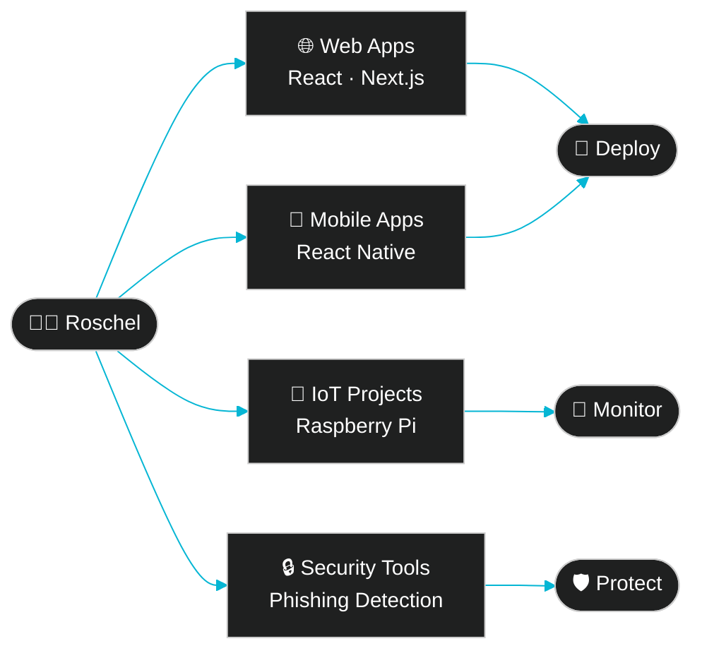

<br>

<div align="center">

<!-- Animated name banner with different font -->


</div>

<br>

<!-- Unique separator: colored dots row -->
<div align="center">
  
</div>

<br>

<!-- Social + stats row -->
<div align="center">

[](https://www.facebook.com/roschelmae.anoos.1)
[](https://www.instagram.com/ru_shelll?igsh=MW5jNGZnYmswZHRwNA==)
[](https://twitter.com/Roschelmae2)
&nbsp;&nbsp;


</div>

<br>

<!-- Two-column intro layout (unique structure) -->
<table align="center" border="0" cellspacing="0" cellpadding="0">
<tr>
<td width="55%" valign="top">

##  Who Am I?

```ts
const roschel: Developer = {
  pronouns : "she/her 🌸",
  location : "🇵🇭 Philippines",
  role     : "Full-Stack Developer",
  status   : "IT Student & Builder",

  stack: {
    frontend : ["React", "Next.js", "React Native", "TailwindCSS"],
    backend  : ["Laravel", "Node.js", "PHP", "Express.js"],
    databases: ["MongoDB", "MySQL", "PostgreSQL"],
    languages: ["JavaScript", "TypeScript", "Python", "PHP", "C++"],
    hardware : ["Raspberry Pi", "IoT Devices"],
  },

  currentlyBuilding : "Things that actually matter 🔨",
  currentlyLearning : ["IoT", "Advanced React", "System Design"],
  funFact           : "I debug with console.log() — no shame 😂",
  philosophy        : "Code → Coffee → Create → Repeat ☕",
};
```

</td>
<td width="5%"></td>
<td width="40%" valign="top">

##  At a Glance


</td>
</tr>
</table>

<br>

<div align="center">
  
</div>

<br>

##  Tech Arsenal

<!-- Unique: skill bars using progress-style layout with icons grouped by category -->

<div align="center">

<table border="0">
<tr>
<td align="center" valign="top" width="25%">

** Frontend**


</td>
<td align="center" valign="top" width="25%">

** Backend**


</td>
<td align="center" valign="top" width="25%">

** Databases**


** Tools**


</td>
<td align="center" valign="top" width="25%">

** Languages**


</td>
</tr>
</table>

</div>

<br>

<!-- Animated skill wave gif unique to this section -->
<div align="center">

</div>

<br>

<div align="center">
  
</div>

<br>

##  Featured Projects

<!-- Unique card layout: alternating left/right with emoji accent colors -->

<div align="center">

<table border="0" cellpadding="10">
<tr>
<td width="50%" valign="top">

<div align="center">

###  ProtectOcean


> Full-stack web & mobile app for reporting illegal ocean activities and protecting marine life.

| Feature | |
|---|---|
| 📍 Real-time geolocation | ✅ |
| 🗑️ Trash monitoring | ✅ |
| 🚨 Illegal activity reporting | ✅ |
| 🐟 Marine life protection | ✅ |

</div>
</td>
<td width="50%" valign="top">

<div align="center">

###  SmartB Barangay System


> Digital barangay management system for online document requests and blotter reports.

| Feature | |
|---|---|
| 📄 Online document requests | ✅ |
| 📝 Blotter filing system | ✅ |
| 📦 Request tracking | ✅ |
| 👥 Citizen portal | ✅ |

</div>
</td>
</tr>

<tr>
<td width="50%" valign="top">

<div align="center">

###  SingKarga Charging Station


> IoT charging station management with Raspberry Pi integration.

| Feature | |
|---|---|
| 📡 Real-time monitoring | ✅ |
| 💳 Payment management | ✅ |
| 📈 Usage tracking | ✅ |
| 🔌 Hardware integration | ✅ |

</div>
</td>
<td width="50%" valign="top">

<div align="center">

###  Email Phishing Detector


> Security tool that analyzes and detects phishing attempts in emails.

| Feature | |
|---|---|
| 🔍 Pattern detection | ✅ |
| ⚠️ Threat analysis | ✅ |
| 🔔 User alerts | ✅ |
| 🛡️ Scam prevention | ✅ |

</div>
</td>
</tr>

<tr>
<td width="50%" valign="top">

<div align="center">

###  E-Commerce Projects


> Multiple online stores: Ice Cream Shop & Dress Shop.

| Feature | |
|---|---|
| 🛍️ Shopping cart system | ✅ |
| 💳 Payment integration | ✅ |
| 📦 Inventory management | ✅ |
| 🚚 Order tracking | ✅ |

</div>
</td>
<td width="50%" valign="top">

<div align="center">

###  More Projects


> School Website, PC Inventory System, Phone Shop POS, File Handling System.

| Feature | |
|---|---|
| 🖥️ Desktop applications | ✅ |
| 🌐 Web development | ✅ |
| 🗄️ Database management | ✅ |
| 🎨 UI/UX design | ✅ |

</div>
</td>
</tr>
</table>

</div>

<br>

<div align="center">
  
</div>

<br>

##  GitHub Analytics

<div align="center">

<!-- Unique: 3-column layout instead of 2 -->


</div>

<br>

<div align="center">
  
</div>

<br>

<div align="center">
  
</div>

<br>

<div align="center">
  
</div>

<br>

##  Currently Up To

<div align="center">


```mermaid
%%{init: {'theme':'dark', 'themeVariables': { 'primaryColor':'#8B5CF6','primaryTextColor':'#fff','primaryBorderColor':'#EC4899','lineColor':'#06B6D4','secondaryColor':'#1a1b27','tertiaryColor':'#2d2e3f','textColor':'#ffffff','fontSize':'15px'}}}%%
flowchart LR
    A(["🧑‍💻 Roschel"]) --> B["🌐 Web Apps\nReact · Next.js"]
    A --> C["📱 Mobile Apps\nReact Native"]
    A --> D["🔌 IoT Projects\nRaspberry Pi"]
    A --> E["🔒 Security Tools\nPhishing Detection"]
    B --> F(["🚀 Deploy"])
    C --> F
    D --> G(["📡 Monitor"])
    E --> H(["🛡️ Protect"])
```

</div>

<br>

<div align="center">

| 🔨 Building | 📚 Learning | 🎯 Goal |
|:---:|:---:|:---:|
| Responsive web apps | IoT Development | Impactful solutions |
| Cross-platform mobile | Advanced React Patterns | Real-world problems |
| Full-stack systems | System Design | Clean, scalable code |
| IoT integrations | Cloud Technologies | Open source contributions |

</div>

<br>

<div align="center">
  
</div>

<br>

##  Contribution Snake

<div align="center">

<picture>
  <source media="(prefers-color-scheme: dark)" srcset="https://raw.githubusercontent.com/Rossyyyyyy/Rossyyyyyy/output/github-contribution-grid-snake-dark.svg">
  <source media="(prefers-color-scheme: light)" srcset="https://raw.githubusercontent.com/Rossyyyyyy/Rossyyyyyy/output/github-contribution-grid-snake.svg">
  
</picture>

</div>

<br>

<div align="center">
  
</div>

<br>

##  Let's Connect

<div align="center">


<br><br>

[](https://www.facebook.com/roschelmae.anoos.1)
[](https://www.instagram.com/ru_shelll?igsh=MW5jNGZnYmswZHRwNA==)
[](https://twitter.com/Roschelmae2)

<br>

**Open to:**


<br><br>

[](https://www.buymeacoffee.com/rossyyyyyy)

<br>


</div>

<br>

<div align="center">
  
</div>

<br>


<div align="center">
  <sub>Made with 💜 by <a href="https://github.com/Rossyyyyyy">Roschel Mae</a> · <i>Code, Coffee, Create, Repeat ☕</i></sub>
</div>
