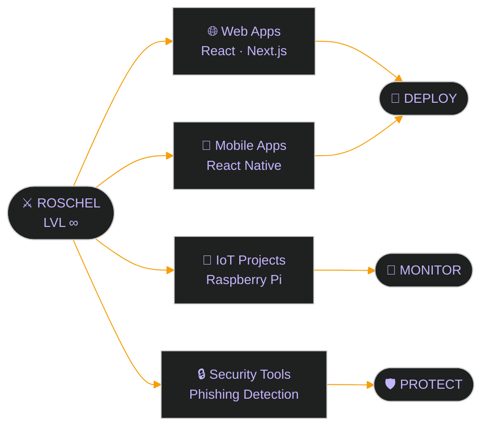

<!-- ╔══════════════════════════════════════════════════════════════╗ -->
<!-- ║         ROSCHEL MAE · GITHUB PROFILE README                 ║ -->
<!-- ║         Auto-generated assets rebuild every 12h             ║ -->
<!-- ╚══════════════════════════════════════════════════════════════╝ -->


<div align="center">


</div>

<br>

<div align="center">

</div>

<br>

<!-- ══════════════════════════════════════════════════════════════ -->
<!--                     PLAYER PROFILE                           -->
<!-- ══════════════════════════════════════════════════════════════ -->

<div align="center">

```
┌─────────────────────────────────────────────────────────────────┐
│                    ⚔   PLAYER PROFILE   ⚔                      │
├──────────────────────────┬──────────────────────────────────────┤
│  NAME      Roschel Mae   │  PRONOUNS    she / her  🌸           │
│  CLASS     Full-Stack    │  REGION      Philippines  🇵🇭         │
│            Developer     │  STATUS      ● ONLINE                │
│  GUILD     IT Student 🎓 │  LEVEL       ∞  (no cap)             │
├──────────────────────────┴──────────────────────────────────────┤
│  MAIN QUEST  ›  Building impactful web & mobile apps            │
│  SIDE QUEST  ›  IoT & hardware exploration with Raspberry Pi    │
│  HIDDEN SKILL›  Debugs with console.log() unashamedly  😂       │
│  MOTTO       ›  Code  →  Coffee  →  Create  →  Repeat  ☕       │
└─────────────────────────────────────────────────────────────────┘
```

</div>

<!-- Social links styled as arcade buttons -->
<div align="center">

[](https://www.facebook.com/roschelmae.anoos.1)
[](https://www.instagram.com/ru_shelll?igsh=MW5jNGZnYmswZHRwNA==)
[](https://twitter.com/Roschelmae2)

</div>

<br>

<!-- Visitor counter -->
<div align="center">


&nbsp;


<sub><i>Every visit counts — thanks for stopping by, adventurer! 🎮</i></sub>

</div>

<br>

<div align="center">

</div>

<br>

<!-- ══════════════════════════════════════════════════════════════ -->
<!--                     PLAYER STATS                             -->
<!-- ══════════════════════════════════════════════════════════════ -->

##  &nbsp;PLAYER STATS &nbsp;<sup><sub>[ LIVE DATA FROM GITHUB ]</sub></sup>

<div align="center">


&nbsp;


</div>

<div align="center">


&nbsp;


</div>

<div align="center">


</div>

<br>

<div align="center">

**🏆 &nbsp;ACHIEVEMENTS UNLOCKED**


</div>

<br>

<div align="center">

</div>

<br>

<!-- ══════════════════════════════════════════════════════════════ -->
<!--                       SKILL TREE                             -->
<!-- ══════════════════════════════════════════════════════════════ -->

##  &nbsp;SKILL TREE

<div align="center">

<table border="0" cellpadding="12" cellspacing="0">
<tr>
<td align="center" valign="top" width="25%">

**🖥️ &nbsp;FRONTEND**
`[ MASTERED ]`


</td>
<td align="center" valign="top" width="25%">

**⚙️ &nbsp;BACKEND**
`[ MASTERED ]`


</td>
<td align="center" valign="top" width="25%">

**🗄️ &nbsp;DATABASES**
`[ MASTERED ]`


**🔧 &nbsp;TOOLS**
`[ EQUIPPED ]`


</td>
<td align="center" valign="top" width="25%">

**💬 &nbsp;LANGUAGES**
`[ UNLOCKED ]`


</td>
</tr>
</table>

</div>

<div align="center">

</div>

<br>

<div align="center">

</div>

<br>

<!-- ══════════════════════════════════════════════════════════════ -->
<!--                       QUEST LOG                              -->
<!-- ══════════════════════════════════════════════════════════════ -->

##  &nbsp;QUEST LOG &nbsp;<sup><sub>[ COMPLETED MISSIONS ]</sub></sup>

<div align="center">

<table border="0" cellpadding="14" cellspacing="0">
<tr>

<td width="50%" valign="top">
<div align="center">

**`✔ QUEST COMPLETE`**
### 🌊 &nbsp;ProtectOcean


> Full-stack web & mobile app for reporting illegal ocean activities and protecting marine life.

| Feature | Status |
|:---|:---:|
| 📍 Real-time geolocation | ✅ |
| 🗑️ Trash monitoring | ✅ |
| 🚨 Illegal activity reporting | ✅ |
| 🐟 Marine life protection | ✅ |

</div>
</td>

<td width="50%" valign="top">
<div align="center">

**`✔ QUEST COMPLETE`**
### 🏛️ &nbsp;SmartB Barangay System


> Digital barangay management system for online document requests and blotter reports.

| Feature | Status |
|:---|:---:|
| 📄 Online document requests | ✅ |
| 📝 Blotter filing system | ✅ |
| 📦 Request tracking | ✅ |
| 👥 Citizen portal | ✅ |

</div>
</td>

</tr>
<tr>

<td width="50%" valign="top">
<div align="center">

**`✔ QUEST COMPLETE`**
### ⚡ &nbsp;SingKarga Charging Station


> IoT charging station management system with Raspberry Pi hardware integration.

| Feature | Status |
|:---|:---:|
| 📡 Real-time monitoring | ✅ |
| 💳 Payment management | ✅ |
| 📈 Usage analytics | ✅ |
| 🔌 Hardware integration | ✅ |

</div>
</td>

<td width="50%" valign="top">
<div align="center">

**`✔ QUEST COMPLETE`**
### 🛡️ &nbsp;Email Phishing Detector


> Security tool that analyzes and detects phishing attempts in emails using pattern recognition.

| Feature | Status |
|:---|:---:|
| 🔍 Pattern detection | ✅ |
| ⚠️ Threat analysis | ✅ |
| 🔔 User alerts | ✅ |
| 🛡️ Scam prevention | ✅ |

</div>
</td>

</tr>
<tr>

<td width="50%" valign="top">
<div align="center">

**`✔ QUEST COMPLETE`**
### 🛒 &nbsp;E-Commerce Projects


> Multiple online stores — Ice Cream Shop & Dress Shop with full cart and payment flows.

| Feature | Status |
|:---|:---:|
| 🛍️ Shopping cart system | ✅ |
| 💳 Payment integration | ✅ |
| 📦 Inventory management | ✅ |
| 🚚 Order tracking | ✅ |

</div>
</td>

<td width="50%" valign="top">
<div align="center">

**`✔ QUEST COMPLETE`**
### 💼 &nbsp;More Projects


> School Website · PC Inventory System · Phone Shop POS · File Handling System.

| Feature | Status |
|:---|:---:|
| 🖥️ Desktop applications | ✅ |
| 🌐 Web development | ✅ |
| 🗄️ Database management | ✅ |
| 🎨 UI/UX design | ✅ |

</div>
</td>

</tr>
</table>

</div>

<br>

<div align="center">

</div>

<br>

<!-- ══════════════════════════════════════════════════════════════ -->
<!--                     ACTIVE QUESTS                            -->
<!-- ══════════════════════════════════════════════════════════════ -->

##  &nbsp;ACTIVE QUESTS

<div align="center">


```mermaid
%%{init: {'theme':'dark','themeVariables':{'primaryColor':'#a855f7','primaryTextColor':'#fff','primaryBorderColor':'#ec4899','lineColor':'#f59e0b','secondaryColor':'#1a0533','tertiaryColor':'#07071a','textColor':'#c4b5fd','fontSize':'14px'}}}%%
flowchart LR
    A(["⚔ ROSCHEL\nLVL ∞"]) --> B["🌐 Web Apps\nReact · Next.js"]
    A --> C["📱 Mobile Apps\nReact Native"]
    A --> D["🔌 IoT Projects\nRaspberry Pi"]
    A --> E["🔒 Security Tools\nPhishing Detection"]
    B --> F(["🚀 DEPLOY"])
    C --> F
    D --> G(["📡 MONITOR"])
    E --> H(["🛡️ PROTECT"])
```

</div>

<br>

<div align="center">

| 🔨 &nbsp;BUILDING | 📖 &nbsp;LEARNING | 🎯 &nbsp;GOAL |
|:---:|:---:|:---:|
| Responsive web apps | IoT Development | Impactful solutions |
| Cross-platform mobile | Advanced React Patterns | Real-world problems |
| Full-stack systems | System Design | Clean, scalable code |
| IoT integrations | Cloud Technologies | Open source contributions |

</div>

<br>

<div align="center">

</div>

<br>

<!-- ══════════════════════════════════════════════════════════════ -->
<!--                   CONTRIBUTION SNAKE                         -->
<!-- ══════════════════════════════════════════════════════════════ -->

##  &nbsp;CONTRIBUTION MAP &nbsp;<sup><sub>[ LIVE FROM GITHUB ]</sub></sup>

<div align="center">

<picture>
  <source media="(prefers-color-scheme: dark)"
          srcset="https://raw.githubusercontent.com/Rossyyyyyy/Rossyyyyyy/output/github-contribution-grid-snake-dark.svg">
  <source media="(prefers-color-scheme: light)"
          srcset="https://raw.githubusercontent.com/Rossyyyyyy/Rossyyyyyy/output/github-contribution-grid-snake.svg">
  
</picture>

</div>

<br>

<div align="center">

</div>

<br>

<!-- ══════════════════════════════════════════════════════════════ -->
<!--                      GUILD HALL                              -->
<!-- ══════════════════════════════════════════════════════════════ -->

##  &nbsp;GUILD HALL &nbsp;<sup><sub>[ LET'S CONNECT ]</sub></sup>

<div align="center">


<br><br>

[](https://www.facebook.com/roschelmae.anoos.1)
[](https://www.instagram.com/ru_shelll?igsh=MW5jNGZnYmswZHRwNA==)
[](https://twitter.com/Roschelmae2)

<br>

**PARTY ROLES AVAILABLE:**


<br><br>

[](https://www.buymeacoffee.com/rossyyyyyy)

<br>


</div>

<br>

<div align="center">

</div>

<br>

<!-- ══════════════════════════════════════════════════════════════ -->
<!--                       FOOTER                                 -->
<!-- ══════════════════════════════════════════════════════════════ -->


<div align="center">
  <sub>
    
    &nbsp;Player <a href="https://github.com/Rossyyyyyy">Rossyyyyyy</a>
    &nbsp;·&nbsp; <i>Code · Coffee · Create · Repeat ☕</i>
    &nbsp;·&nbsp;
    
  </sub>
</div>
